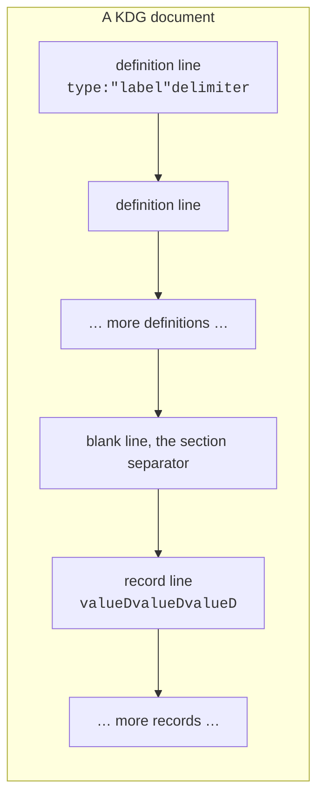
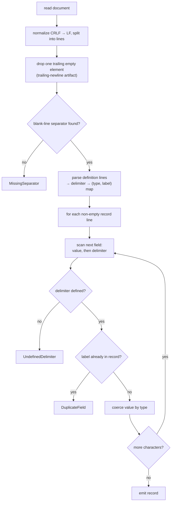
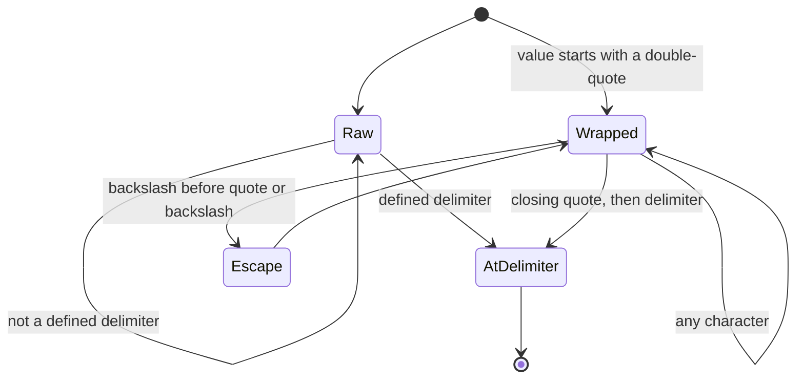

# KDG: Key-Delimited Grammar

**Format Specification**

| | |
|---|---|
| **Version** | 1.1.0 |
| **Status** | Stable |
| **Date** | 2026-10-08 |
| **Media type** | `text/x-kdg` |
| **File extension** | `.kdg` |
| **Reference implementations** | 9 (see [Appendix A](#appendix-a-reference-implementations)) |


---

## Abstract

KDG (Key-Delimited Grammar) is a text-based data serialization format in which **field identity is encoded in the choice of delimiter**, rather than in position (CSV) or in an explicit key (JSON).

Every field in a KDG document is assigned a unique delimiter character. In the data section, a value is written followed by its field's delimiter:

```
str:"name"@
int:"age"#

Alice@30#
Bob@25#
```

The parser reads a value, sees the `@`, and knows the value was a *name*; sees the `#`, and knows it was an *age*. Fields may appear in any order, are not repeated per record, and the document stays human-readable.

This document is the normative specification: the grammar, type system, parsing algorithm, error taxonomy, test vectors, conformance requirements, and security considerations.

**Related documents:** [PHILOSOPHY.md](./PHILOSOPHY.md), the design rationale.

**Naming:** KDG is a three-letter handle. This specification uses the expansion "Key-Delimited Grammar". "Key-Delimited Garbage" is an accepted alternative. The full list of expansions is in the [README](./README.md#the-name).

---

## Table of Contents

1. [Introduction](#1-introduction)
2. [Document Structure](#2-document-structure)
3. [Grammar](#3-grammar)
4. [Type System](#4-type-system)
5. [Parsing Algorithm](#5-parsing-algorithm)
6. [Escape Sequences](#6-escape-sequences)
7. [Error Handling](#7-error-handling)
8. [Test Vectors](#8-test-vectors)
9. [Conformance](#9-conformance)
10. [Security Considerations](#10-security-considerations)
11. [Media Type Registration](#11-media-type-registration)
12. [Appendix A: Reference Implementations](#appendix-a-reference-implementations)
13. [Appendix B: Changelog](#appendix-b-changelog)

---

## 1. Introduction

### 1.1 Motivation

Text serialization formats have, for decades, offered a binary choice:

| Format | Field identity | Cost |
|--------|----------------|------|
| CSV | Column position | Fragile; reorder a column and every consumer breaks |
| JSON | Repeated explicit keys | Verbose; the same key is restated on every single record |
| XML | Explicit tags | Most verbose of all |
| KDG | The delimiter | Compact **and** order-independent |

CSV pays for compactness with positional fragility. JSON pays for order-independence with per-record repetition. KDG observes a fact both formats ignore: **the delimiter is already there, and it is carrying no information.** It repurposes the separator as the key.

### 1.2 Design Goals

1. **Order independence**: records may list fields in any order.
2. **Compactness**: field names appear once (in the schema), never per record.
3. **Human readability**: plain text, inspectable with `cat` or `less`.
4. **Type safety**: types are declared once in the schema and enforced per value.
5. **Simplicity**: the whole grammar fits on one page; a parser fits in one file.
6. **Zero dependencies**: every reference implementation uses only its language's standard library.

### 1.3 Non-Goals

The following are explicitly **out of scope** and will not be added:

- **Nesting**: records are flat. There is no object/array tree. If you need nesting, you need JSON, and you already have it.
- **Streaming records**: a document is read whole. Records are newline-terminated, so a line-oriented reader *can* stream, but the schema must be seen first.
- **Schema evolution/migration**: KDG describes data; it does not describe how data changes over time.
- **Binary encoding**: KDG is text. Binary formats solve a different problem.
- **Self-describing data**: a KDG document is only meaningful against its definition block. It is a schema-first format by design.

### 1.4 Design Rationale

**Why delimiters, and not anything else?** A record must separate fields somehow, and that separator is wasted information in every existing format. The design space of "how to identify a field" is small:

- **Position** (CSV): implicit, fragile, zero per-record cost.
- **Explicit key** (JSON): self-describing, verbose, per-record cost.
- **Fixed schema + separator** (KDG): explicit *once*, per-record cost of one character.

KDG picks the third. The delimiter is a one-character key that is declared once and reused thereafter.

**Why single-character delimiters?** Because a record is then trivially scannable: a parser never needs lookahead, backtracking, or a lexer state machine beyond "am I inside quotes?". The trade-off is a finite namespace, which is why the delimiter rules (Section 3) are conservative about what may be used.

**Why these five types?** `str`, `int`, `float`, `bool`, `date` cover the overwhelmingly common case of tabular/record data without inviting the complexity of a full type algebra. A type's *name* is part of the schema; a type's *values* are validated against it (Section 4).

**Why a schema (definition block) at all?** Because type safety and compactness both require it: the type is declared next to the label and delimiter, once, instead of being inferred per value. A format without a schema could not be compact *and* typed.

### 1.5 Terminology

The key words **MUST**, **MUST NOT**, **REQUIRED**, **SHALL**, **SHALL NOT**, **SHOULD**, **SHOULD NOT**, **RECOMMENDED**, **MAY**, and **OPTIONAL** are to be interpreted as described in [RFC 2119](https://tools.ietf.org/html/rfc2119).

| Term | Meaning |
|------|---------|
| **Definition block** | The leading section that declares each field's type, label, and delimiter |
| **Data block** | The section of records that follow the separator |
| **Delimiter** | The single character that suffixes a value and identifies its field |
| **Label** | A field's human-readable name |
| **Record** | One line in the data block; a sequence of fields |
| **Wrapped value** | A value enclosed in double quotes, permitted to contain delimiters |

---

## 2. Document Structure

A KDG document is exactly two sections separated by exactly one blank line.

```
        ┌─────────────────────────────────────────────┐
        │              DEFINITION BLOCK               │
        │  one field per line:  type:"label"delimiter  │
        ├─────────────────────────────────────────────┤
        │          (one blank line: separator)        │
        ├─────────────────────────────────────────────┤
        │                 DATA BLOCK                  │
        │   one record per line:  valueDvalueDvalueD   │
        └─────────────────────────────────────────────┘
```

The same structure, as a flow:



### 2.1 Definition Block

The definition block declares fields. Each line declares exactly one field:

```
type:"label"delimiter
```

- **`type`**: one of `str`, `int`, `float`, `bool`, `date` (Section 4).
- **`label`**: a human-readable field name, enclosed in double quotes.
- **`delimiter`**: a single character that identifies this field in records.

Example:

```
str:"name"@
int:"age"#
bool:"active"!
```

### 2.2 Section Separator

A single blank line, an empty line containing only a newline, separates the definition block from the data block. It is required; its absence is an error (`MissingSeparator`, Section 7.1).

### 2.3 Data Block

The data block contains records. Each line is one record. Within a record, fields are identified by their **trailing delimiter**, never by position:

```
value1delimiter1value2delimiter2value3delimiter3
```

Because identity is carried by the delimiter, the two records below are equivalent:

```
Alice@30#
30#Alice@
```

Empty lines in the data block are ignored.

---

## 3. Grammar

### 3.1 EBNF Grammar

```ebnf
document       = definitions , separator , records ;
definitions    = definition , { newline , definition } ;
definition     = type , ":" , quoted_label , delimiter ;
type           = "str" | "int" | "float" | "bool" | "date" ;
quoted_label   = '"' , label_chars , '"' ;
label_chars    = { any_char - '"' | '\"' } ;
delimiter      = visible_char - (alphanumeric | '"' | ':') ;
separator      = newline , newline ;
records        = [ record , { newline , record } ] ;
record         = field , { field } ;
field          = value , delimiter ;
value          = raw_value | wrapped_value ;
raw_value      = { any_char - defined_delimiter } ;
wrapped_value  = '"' , { any_char - '"' | '\"' } , '"' ;
newline        = LF | CRLF ;
visible_char   = ? any printable ASCII or Unicode character ? ;
alphanumeric   = "a"-"z" | "A"-"Z" | "0"-"9" ;
```

Notes on the grammar:

- A **raw value** may contain any character *except* a defined delimiter; the first defined delimiter encountered terminates it.
- A **wrapped value** is enclosed in double quotes and may contain anything, including delimiters; the terminating delimiter follows the closing quote.
- The grammar is **LL(1)**: the parser never backtracks. This is a deliberate property, not an accident; it is what makes a correct implementation fit in one page of any language.

### 3.2 Syntax Overview

Inline form of the two core productions:

```
definition  →  type  ":"  '"'  label  '"'  delimiter
record      →  ( value  delimiter )+
value       →  raw_value | '"' wrapped_content '"'
```

### 3.3 Lexical Rules

1. **Delimiters** MUST be visible (non-whitespace) characters.
2. **Delimiters** MUST NOT be alphanumeric, `:`, or `"`.
3. **Delimiters** MUST be unique within a document.
4. **Labels** MUST be enclosed in double quotes.
5. **Labels** MAY contain escaped quotes (`\"`).
6. **Values** MAY be wrapped in double quotes.
7. **Wrapped values** MAY contain delimiter characters.
8. **Records** MUST NOT contain undefined delimiters at field-terminating positions.
9. **Empty lines** in the data block are ignored.

### 3.4 Reserved Characters

The following characters cannot be used as delimiters:

| Character(s) | Reason |
|--------------|--------|
| `a`–`z`, `A`–`Z`, `0`–`9` | Reserved for values |
| `:` | Separates type and label in a definition |
| `"` | Quotes labels and wrapped values |
| Space, tab, newline | Whitespace; delimiters must be visible |

### 3.5 Recommended Delimiters

Any valid delimiter works, but these are recommended for readability:

| Delimiter | Suggested use |
|-----------|---------------|
| `@` | Identifiers, usernames |
| `#` | Numeric IDs, counts |
| `$` | Currency, amounts |
| `%` | Percentages, ratios |
| `&` | Associations, links, email addresses |
| `!` | Flags, alerts |
| `~` | Descriptions, notes |
| `^` | Priorities, levels |
| `/` | Paths, categories |
| `\|` | Separators, choices |

> **Do not use `@` for email fields.** An email address contains `@`, so it cannot terminate an email field. Use `&` (as the examples do) for addresses.

---

## 4. Type System

### 4.1 Supported Types

| Type | Description | Valid values |
|------|-------------|--------------|
| `str` | Unicode string | Any text |
| `int` | Signed integer | `-?[0-9]+` |
| `float` | Floating point | `-?[0-9]+\.?[0-9]*` |
| `bool` | Boolean | `true`, `false`, `1`, `0` |
| `date` | ISO 8601 date | `YYYY-MM-DD` |

A value that does not match its declared type is a `TypeMismatch` error (Section 7.1).

### 4.2 str

Accepts any valid UTF-8 text. Leading and trailing whitespace is preserved. Empty strings are valid.

```
str:"name"@

@        → name = ""
Alice@   → name = "Alice"
```

### 4.3 int

Accepts a signed integer: an optional `-`, then one or more digits. Leading zeros are permitted but not recommended (`007` parses as `7`). A value that is not a well-formed integer, or that overflows the implementation's integer range, is a `TypeMismatch`.

| Input | Result |
|-------|--------|
| `42` | `42` |
| `-42` | `-42` |
| `0` | `0` |
| `007` | `7` |
| `4.2` | `TypeMismatch` |
| `4x` | `TypeMismatch` |

### 4.4 float

Accepts standard notation (`3.14`, `-2.5`), integer notation (`42`, coerced to `42.0`), and a leading decimal (`.5`, coerced to `0.5`). Scientific notation is **not** supported in this version.

| Input | Result |
|-------|--------|
| `3.14` | `3.14` |
| `-2.5` | `-2.5` |
| `42` | `42.0` |
| `.5` | `0.5` |
| `1e3` | `TypeMismatch` |

### 4.5 bool

Accepts, case-insensitively: `true` or `1` → `true`; `false` or `0` → `false`.

| Input | Result |
|--------|--------|
| `true`, `TRUE`, `1` | `true` |
| `false`, `FALSE`, `0` | `false` |
| `yes`, `2` | `TypeMismatch` |

### 4.6 date

Accepts ISO 8601 dates in `YYYY-MM-DD` form. The year MUST be in the range `1`–`9999`, and the date MUST be a real calendar day (leap years are honored: `2024-02-29` is valid, `2023-02-29` is not). The value is returned as its string form for serialization.

| Input | Result |
|-------|--------|
| `2024-12-22` | `"2024-12-22"` |
| `2024-02-29` | `"2024-02-29"` (leap year) |
| `2023-02-29` | `TypeMismatch` |
| `0000-01-01` | `TypeMismatch` (year out of range) |
| `10000-01-01` | `TypeMismatch` (year out of range) |

Time components are not supported.

### 4.7 Coercion Summary

| Type | Coercion | Failure |
|------|----------|---------|
| `str` | identity | *(never)* |
| `int` | `parse_int` | `TypeMismatch` |
| `float` | `parse_float` | `TypeMismatch` |
| `bool` | lowercase, then `true/1` → true, `false/0` → false | `TypeMismatch` |
| `date` | split on `-`, validate year `1`–`9999` and calendar day | `TypeMismatch` |

---

## 5. Parsing Algorithm

### 5.1 Overview



The algorithm is:

```
1. Split the document into lines (normalizing CRLF to LF).
2. Parse definition lines until the blank-line separator.
3. Build a delimiter → (type, label) map.
4. Parse each record line using the delimiter map.
5. Return the array of record objects.
```

### 5.2 Definition Parsing

For each line in the definition block, match against the definition grammar (Section 3.1). Capture the type, the raw label (unescaping `\"` → `"` and then `\\` → `\`, in that order), and the delimiter. Validate the type against the five supported types and the delimiter against the reserved set; register the delimiter in the map, erroring on a duplicate.

```python
match = regex(r'^([a-z]+):"((?:[^"\\]|\\.)*)"(.)$')
type, raw_label, delimiter = match.groups()
label = raw_label.replace('\\"', '"').replace("\\\\", "\\")
```

### 5.3 Record Parsing

Each record line is scanned left to right. A field is **value, then delimiter**, never the reverse.

```python
fields = {}
position = 0
while position < len(line):
    # value may be wrapped in double quotes
    if line[position] == '"':
        value, position = scan_wrapped(line, position)   # → after closing quote
    else:
        value, position = scan_raw(line, position)       # → at next delimiter

    delimiter = line[position]
    type, label = delimiter_map[delimiter]               # else UndefinedDelimiter
    fields[label] = convert(value, type)                 # else DuplicateField / TypeMismatch
    position += 1
```

The field scanner is a tiny state machine:



- **Raw value**: consume characters until the next *defined* delimiter.
- **Wrapped value**: consume from the opening quote to the closing quote, honoring `\"` and `\\` escapes; the field's delimiter is the single character immediately after the closing quote.
- A value with no terminating delimiter is an error (`No delimiter found…` / `Missing delimiter after value…`).

### 5.4 Delimiter Collision

A delimiter appearing more than once in a single record means the same field is stated twice. Parsers MUST raise `DuplicateField`.

### 5.5 Missing Fields

Records MAY omit fields. Parsers SHOULD omit missing fields from the output object (they MAY instead represent them as `null`/`None`/`undefined`). The reference implementations omit them.

---

## 6. Escape Sequences

### 6.1 In Labels

| Sequence | Meaning |
|----------|---------|
| `\"` | Literal double quote |
| `\\` | Literal backslash |

### 6.2 In Values

Values MAY be wrapped in double quotes. Wrapping is optional, but **required** when a value contains a delimiter character (which would otherwise terminate the value early).

```
str:"name"@
str:"note"#

Alice@"contains @ and # symbols"#
Bob@no wrapping needed#
```

| Sequence | Meaning |
|----------|---------|
| `\"` | Literal double quote |
| `\\` | Literal backslash |

Unwrapped values do not support escape sequences; a backslash in an unwrapped value is literal.

---

## 7. Error Handling

### 7.1 Error Catalog

| Error | Raised when | Example trigger |
|-------|-------------|-----------------|
| `DuplicateDelimiter` | The same delimiter is defined twice | `str:"a"@` then `str:"b"@` |
| `InvalidType` | An unknown type identifier appears | `strr:"name"@` |
| `MalformedDefinition` | A definition line does not match the grammar, or uses a reserved delimiter | `str:"name"` (no delimiter) |
| `UndefinedDelimiter` | A record uses a delimiter that was never declared | `Alice@x#` with `#` undeclared |
| `DuplicateField` | The same field appears twice in one record | `Alice@Bob@` |
| `TypeMismatch` | A value does not match its declared type | `int:"age"#` then `Bob#` |
| `MissingSeparator` | There is no blank line between the sections | *(definitions run straight into data)* |
| `UnterminatedValue` | A quoted value has no closing quote | `"Alice` |

### 7.2 Error Format

Parsers SHOULD report errors with a **line number**, an **error type**, and a **descriptive message**, in the form:

```
Line <n>: <message>
```

The `MissingSeparator` error is reported without a line number (it concerns the document as a whole).

A conformant parser's messages need not be byte-identical across languages, but a given error's message MUST contain the canonical fragment below, so that test tooling can match errors uniformly:

| Error | Canonical message fragment |
|-------|---------------------------|
| `DuplicateDelimiter` | `already used` |
| `InvalidType` | `Unknown type` |
| `MalformedDefinition` | `Invalid definition syntax` |
| `UndefinedDelimiter` | `Undefined delimiter` |
| `DuplicateField` | `Duplicate field` |
| `TypeMismatch` | `Invalid integer` / `Invalid float` / `Invalid boolean` / `Invalid date` |
| `MissingSeparator` | `No blank line separator` |
| `UnterminatedValue` | `Unterminated quoted value` |

---

## 8. Test Vectors

The `tests/vectors/` directory is the conformance suite. Every reference implementation MUST pass all of it. Each invalid vector has an adjacent `.expected` file containing the message fragment the parser's stderr must include.

### 8.1 Minimal

```
str:"name"@

Alice@
```

→ `[{"name": "Alice"}]`

### 8.2 All Types

```
str:"name"@
int:"age"#
float:"score"%
bool:"active"!
date:"joined"/

Bob@30#95.5%true!2024-01-15/
```

→ `[{"name": "Bob", "age": 30, "score": 95.5, "active": true, "joined": "2024-01-15"}]`

### 8.3 Order Independence

```
str:"first"@
str:"last"#
int:"age"%

Doe#Jane@28%
John@35%Smith#
42%Alice@Wonder#
```

→ three records whose fields are identified by delimiter, not position.

### 8.4 Unicode

```
str:"greeting"@
str:"name"#

こんにちは@田中#
Привет@Мария#
مرحبا@أحمد#
```

Values and labels are UTF-8 and are never escaped in output.

### 8.5 Escaped Quotes in Labels

```
str:"user\"s name"@
str:"path\\to\\file"#

Alice@C:\Users\Alice#
```

→ labels `user"s name` and `path\to\file`.

### 8.6 Wrapped Values

```
str:"name"@
str:"note"#

Alice@"contains @ and # symbols"#
"He said \"hi\""@quoted value#
```

A wrapped value may contain delimiters and escaped quotes.

### 8.7 Dates

```
date:"joined"/

2024-02-29/
0001-01-01/
9999-12-31/
```

Leap days and the year boundaries are valid.

### 8.8 Invalid Vectors

| Vector | Expected error |
|--------|----------------|
| `duplicate-delimiter.kdg` | `DuplicateDelimiter` |
| `duplicate-field.kdg` | `DuplicateField` |
| `invalid-date-day.kdg` | `TypeMismatch` (2023-02-29) |
| `invalid-date-year.kdg` | `TypeMismatch` (10000-01-01) |
| `invalid-type.kdg` | `InvalidType` |
| `malformed-definition.kdg` | `MalformedDefinition` |
| `missing-separator.kdg` | `MissingSeparator` |
| `type-mismatch.kdg` | `TypeMismatch` |
| `undefined-delimiter.kdg` | `UndefinedDelimiter` |
| `unterminated-value.kdg` | `UnterminatedValue` |

---

## 9. Conformance

A conforming implementation MUST satisfy every MUST below, SHOULD satisfy every SHOULD, and MAY implement every MAY.

| # | Requirement | Level | Enforced by |
|---|-------------|-------|-------------|
| R1 | Delimiters are visible characters | MUST | all valid vectors |
| R2 | Delimiters are not alphanumeric, `"`, or `:` | MUST | `malformed-definition` |
| R3 | Delimiters are unique within a document | MUST | `duplicate-delimiter` |
| R4 | Labels are double-quoted | MUST | `malformed-definition` |
| R5 | A definition line parses as `type:"label"delimiter` | MUST | all valid vectors |
| R6 | A blank line separates the two sections | MUST | `missing-separator` |
| R7 | Fields are identified by delimiter, not position | MUST | `order-independence` |
| R8 | Wrapped values may contain delimiters | MUST | `wrapped` |
| R9 | Unknown delimiters in records are rejected | MUST | `undefined-delimiter` |
| R10 | A field stated twice in a record is rejected | MUST | `duplicate-field` |
| R11 | Values are validated against their declared type | MUST | `type-mismatch`, `invalid-date-*` |
| R12 | Dates are constrained to years 1–9999 and real days | MUST | `dates`, `invalid-date-*` |
| R13 | Unknown types are rejected | MUST | `invalid-type` |
| R14 | Unterminated quoted values are rejected | MUST | `unterminated-value` |
| R15 | Escaped quotes/backslashes unescape correctly | MUST | `escaped`, `wrapped` |
| R16 | CRLF and LF line endings are equivalent | MUST | *(harness normalizes)* |
| R17 | UTF-8 is preserved unescaped in output | MUST | `unicode` |
| R18 | JSON output uses 2-space indentation | SHOULD | harness |
| R19 | Errors carry a line number and message | SHOULD | harness |
| R20 | A CLI with `parse`, `validate`, `convert` is provided | SHOULD | CONTRIBUTING |
| R21 | Missing fields are omitted from output | MAY | *(examples)* |
| R22 | CSV output quotes fields containing commas/quotes/newlines | SHOULD | harness |

### 9.1 Conformance Test Matrix

The test harness (`tests/run_tests.py`) executes the conformance suite against every reference implementation and checks:

- every valid vector **parses** to its expected JSON, in each implementation;
- every invalid vector **fails** with the expected error fragment, in each implementation;
- every example **validates**, in each implementation;
- `convert` (JSON and CSV) succeeds for every valid vector.

---

## 10. Security Considerations

### 10.1 Input Validation

Parsers MUST validate input to prevent:

- **Resource exhaustion** from extremely large documents (the format is flat, so there is no recursion or nesting to exploit).
- **Line-length abuse**: a single record line of unbounded length. Implementations SHOULD support a configurable maximum input size.
- **Invalid UTF-8**: implementations SHOULD reject malformed byte sequences rather than propagate them into output.

### 10.2 Output Encoding

When converting to JSON or CSV, parsers MUST escape output correctly:

- JSON: escape `"` and `\` (and control characters); never emit unescaped raw bytes into a quoted string.
- CSV: quote any field containing a comma, double quote, or newline, doubling internal quotes.

This prevents delimiter-injection and quote-escaping attacks when output is consumed by another system.

### 10.3 Delimiter Confusion

Because field identity is the delimiter itself, a document whose *data* is attacker-controlled must never allow the attacker to choose delimiters: the definition block (the schema) is always authored by the trusted party. A value that must contain a delimiter is wrapped in quotes, so it cannot be mistaken for a field boundary.

---

## 11. Media Type Registration

- **Type name**: `text`
- **Subtype name**: `kdg`
- **Required parameters**: none
- **Optional parameters**: `charset` (default `utf-8`)
- **Encoding considerations**: text; MUST be UTF-8
- **File extension**: `.kdg`
- **Magic number(s)**: none
- **Intended usage**: tabular/record data with a declared schema

---

## Appendix A: Reference Implementations

The following implementations are normative for ambiguous cases not covered by this specification. They are all zero-dependency (standard library only) and each ships a CLI with `parse`, `validate`, and `convert`:

| Language | File | Run as |
|----------|------|--------|
| Python | `implementations/kdg.py` | `python3 implementations/kdg.py parse <file>` |
| JavaScript | `implementations/kdg.js` | `node implementations/kdg.js parse <file>` |
| Go | `implementations/kdg.go` | `go run implementations/kdg.go parse <file>` |
| C | `implementations/kdg.c` | `cc implementations/kdg.c && ./a.out parse <file>` |
| Bash | `implementations/kdg.sh` | `bash implementations/kdg.sh parse <file>` |
| Haskell | `implementations/kdg.hs` | `runghc implementations/kdg.hs parse <file>` |
| PowerShell | `implementations/kdg.ps1` | `pwsh -File implementations/kdg.ps1 parse <file>` |
| R | `implementations/kdg.R` | `Rscript implementations/kdg.R parse <file>` |
| BQN | `implementations/kdg.bqn` | `bqn implementations/kdg.bqn parse <file>` |

---

## Appendix B: Changelog

### 1.1.0 (2026-10-08)

- Rewrote this document: added design rationale, non-goals, a conformance section, an error catalog, a full test-vector catalog, Mermaid diagrams, and a media-type registration.
- Documented the `UnterminatedValue` error.
- Clarified date validation: years are constrained to `1`–`9999`.
- Added six reference implementations (C, Bash, Haskell, PowerShell, R, BQN).
- Corrected the recommended-delimiter guidance (no `@` for emails).

### 1.0.0 (2024-12-22)

- Initial stable release: core grammar, type system, parsing algorithm, and test vectors.
